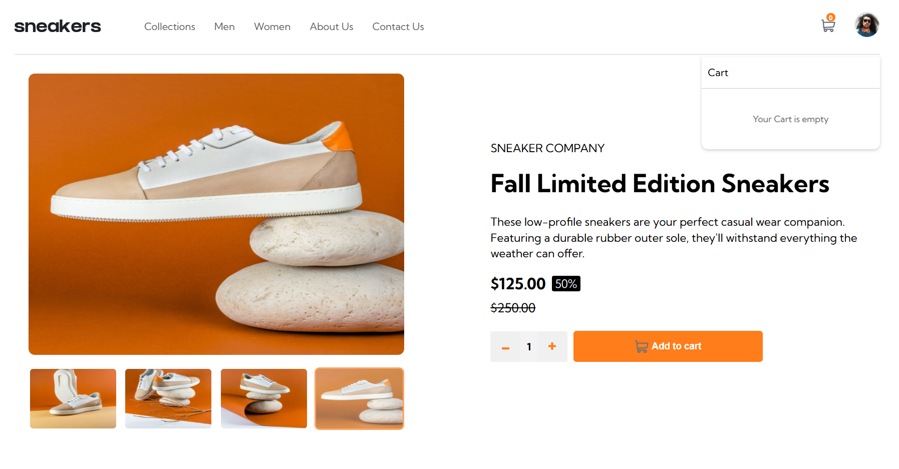
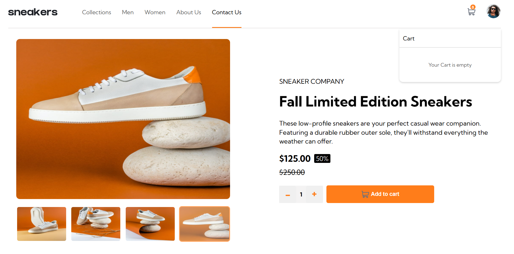
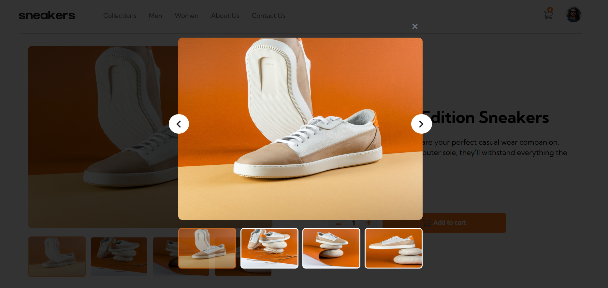
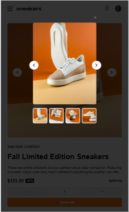
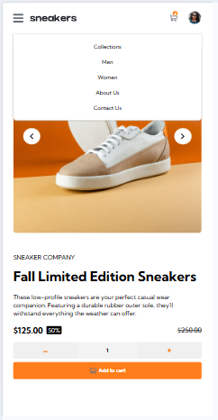
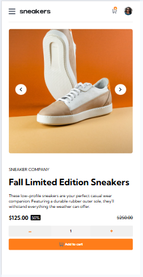
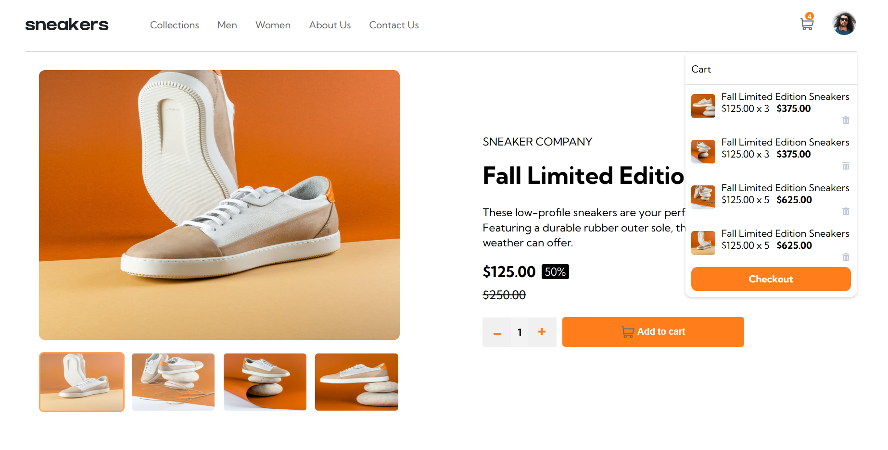

# Sneaker-Ecommerce-Project-Challenge
This repository is for a challenge, the challenge is for an E commerce project to get familiarized with Javascript

## Table of Contents
- [Overview](#overview)
  - [The challenge](#the-challenge)
  - [Screenshot](#screenshot)
  - [Links](#links)
- [My process](#my-process)
  - [Built with](#built-with)
  - [What I learned](#what-i-learned)
  - [Continued development](#continued-development)
  - [Useful resources](#useful-resources)
  - [AI Collaboration](#ai-collaboration)
- [Author](#author)
- [Acknowledgments](#acknowledgments)

## Overview

### The Challenge

User should be able to:     - View the optimal layout for the site depending on their device's screen size;
                            - See hover states for all interactive elements on the page;
                            - Open a lightbox gallery by clicking on the large product image;
                            - Switch the large product image by clicking on the small thumbnail images;
                            - Add items to the cart;
                            - View the cart and remove items from it.

### The Features
  - Responsive design (mobile, tablet, desktop);
  - Interactive UI elements;
  - Clean and modern layout;
  - Fast loading performance.

##  Screenshots
  - ;
  - ;
  - ;
  - ;
  - ;
  - ;
  - ;
  - ;
  - .

## Links
[] ()
[] ()

## My Process

### Built with 
- Semantic HTML5 markup;
- CSS custom properties;
- Flexbox;
- Mobile-first workflow;
- Javascript.

### What I learned
  - I learnt more about DOM manipulation to change contents and style of targeted elements;
  - I learnt more about Conditions and function calling;
  - I learnt more about using arrays and objects to store data and how to target those data efficiently and effectively.

### Continued development

- DOM Manipulation;
- Arrays and objects;
- Foreach functions, other functions and conditions;
- Clean code writing and arranging.

### AI Collaboration
  VSCODE COPILOT AI
- I used VSCode Copilot AI to brainstorm ideas on cleaner and efficient codes for features like the 'add to cart' and 'image change' features;
- It also aided in dividing the code into sections for easy reading and comments for better understanding of the code;
- The AI was helpful but sometimes too sophisticated. It complicates easy codes which results in bugs which I had to debug such as a bug found in  the cart variable when items are added or removed from the cart and so on.

## Author
- name - YUSUF NURUDEEN ADEBAYO (Luminus)
- Whatsapp Number - 07075573916
- Github [@nurudeenheroic](https://github.com/nurudeenheroic);
- Frontend Mentor - [@nurudeenheroic](https://www.frontendmentor.io/profile/nurudeenheroic);
- Instagram - [@nuru_deenyusuf](https://www.instagram.com/nuru_deenyusuf?igsh=YTlrZTI4Y3lzOW0x);
- Linkedin - [@nurudeen_yusuf](https://www.linkedin.com/in/nurudeen-yusuf-384891378?utm_source=share_via&utm_content=profile&utm_medium=member_android);
